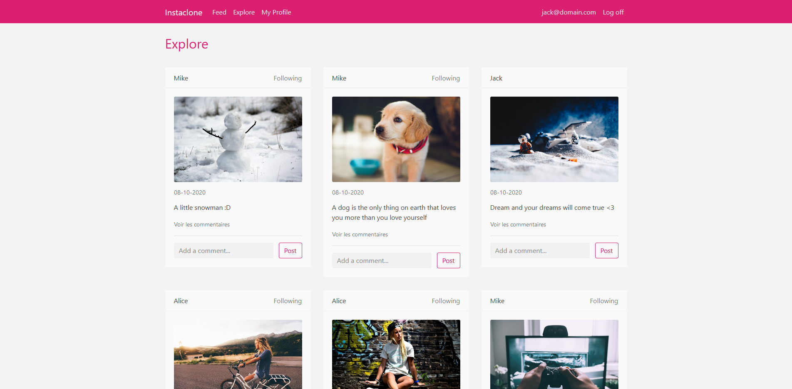
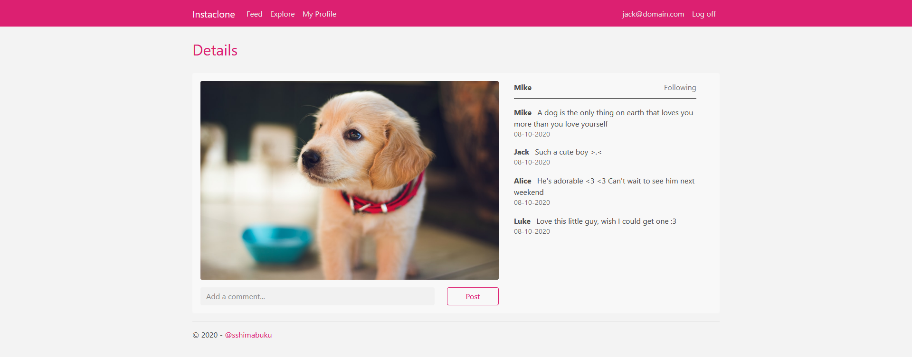
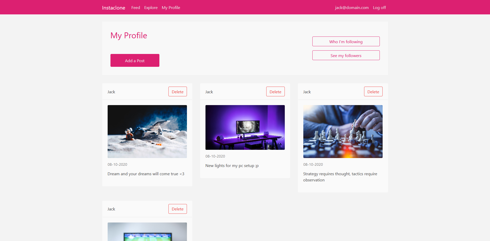
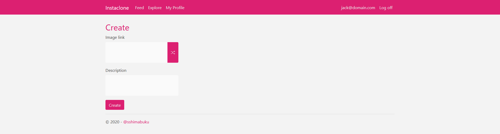

# Instaclone

This is a web application inspired by the Instagram social media platform. Users can create, view posts, follow other users and comment on posts.

## How to run

> Note: The instaclone website is no longer available

1. Open with Visual Studio and SSMS

-   Download or clone project repo
-   Open .sln project
-   Open package manager
-   Type `Update-database`
-   Build the project `Ctrl + Shift + B`
-   Run `Ctrl + F5`

## How to use Instaclone

1. Create a user

2. Visit the following pages

-   Personal feed
-   Explore page
-   Profile page

3. Try the following actions

-   Create a post
-   Delete a post
-   Follow a user
-   Unfollow a user
-   Comment on a post

## User Stories

### Iteration #1

-   As a user, I want to create a post
-   As a user, I want to view all posts
-   As a user, I want to follow another user
-   As a user, I want to have a personalized posts feed
-   As a user, I want to know who I'm following

### Iteration #2

-   As a user, I want to view my posts
-   As a user, I want to comment on a post
-   As a user, I want to delete a post
-   As a user, I want to view post's comments

### Iteration #3

-   As a user, I want to know who follows me
-   As a user, I want to unfollow a user

## Features

-   Post creation

    -   Updates explore page, personal feed and profile page
    -   Users can currently only follow from the post's follow link

-   Following system

    -   Will update current user's feed
    -   Users can check their followers and followees on their profile
    -   Users can currently only unfollow from their profile

-   Comment system
    -   Users can comment on any post
    -   Comments will be displayed when checking the post details

## What it looks like

### Explore page

### Post's details

### Profile

### Post creation

